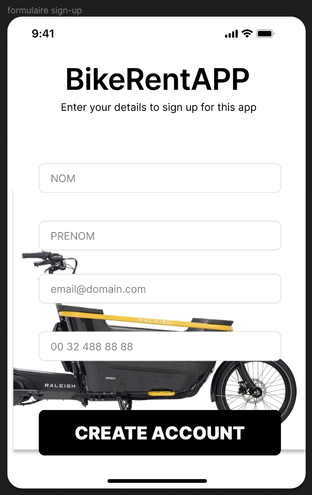
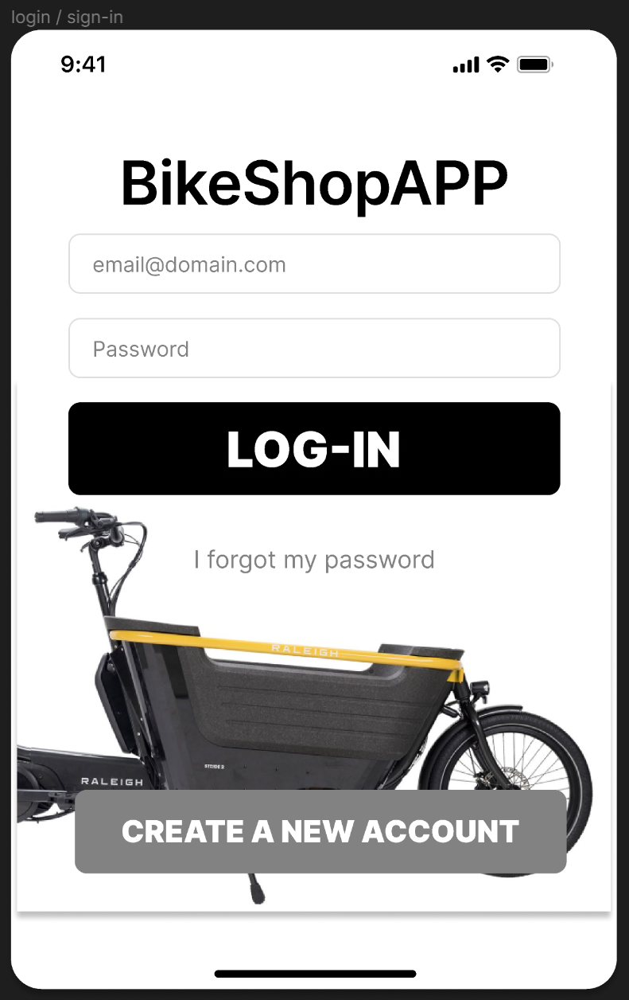
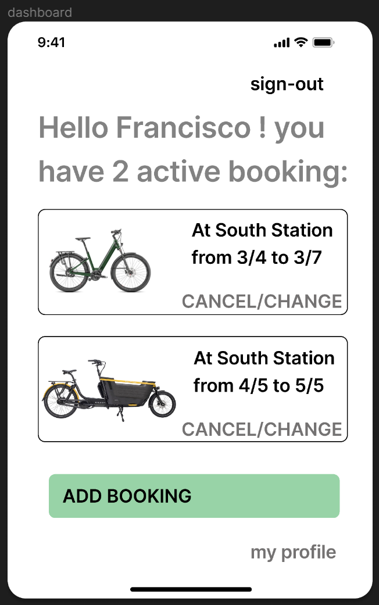
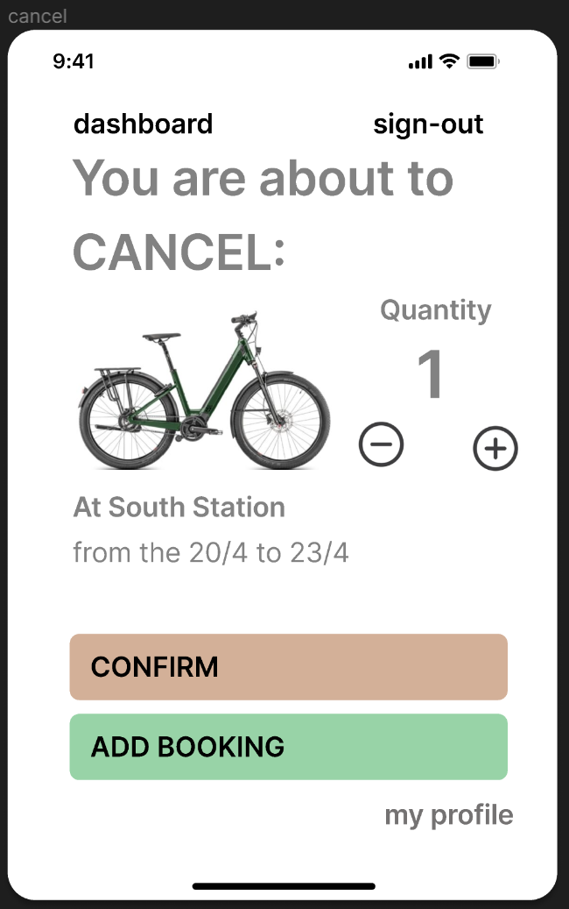
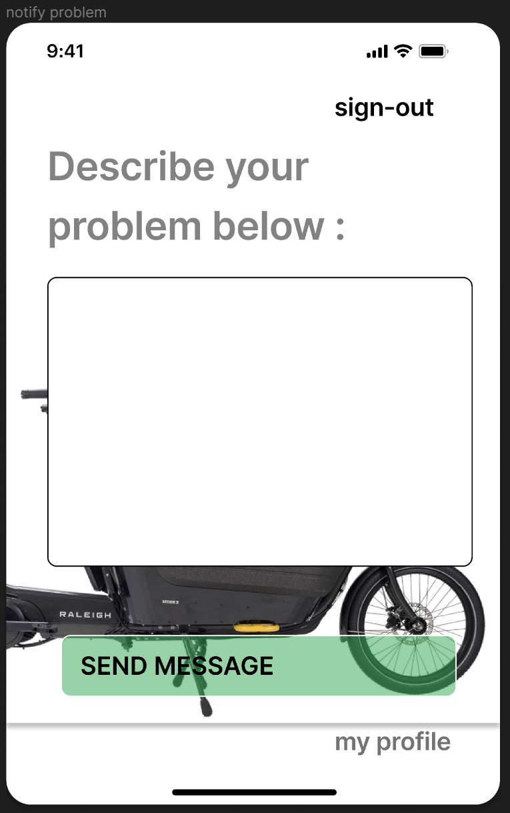
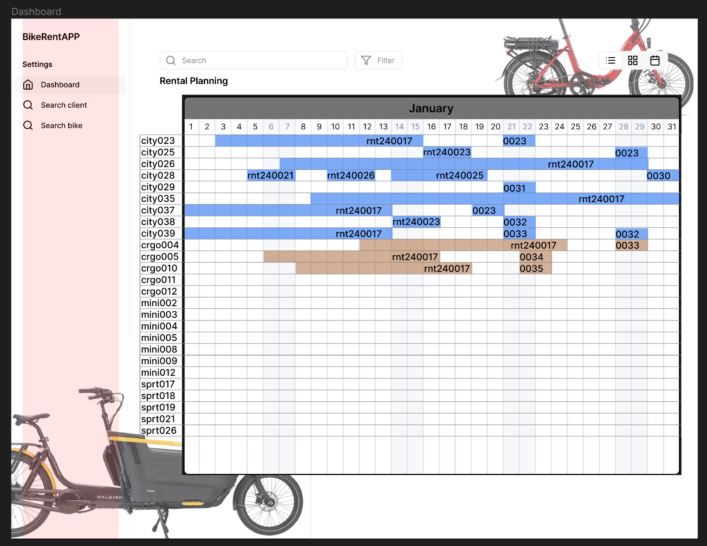
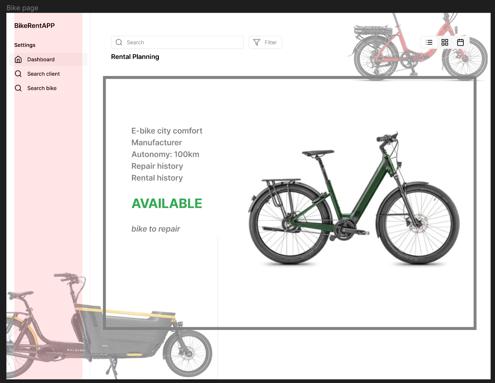
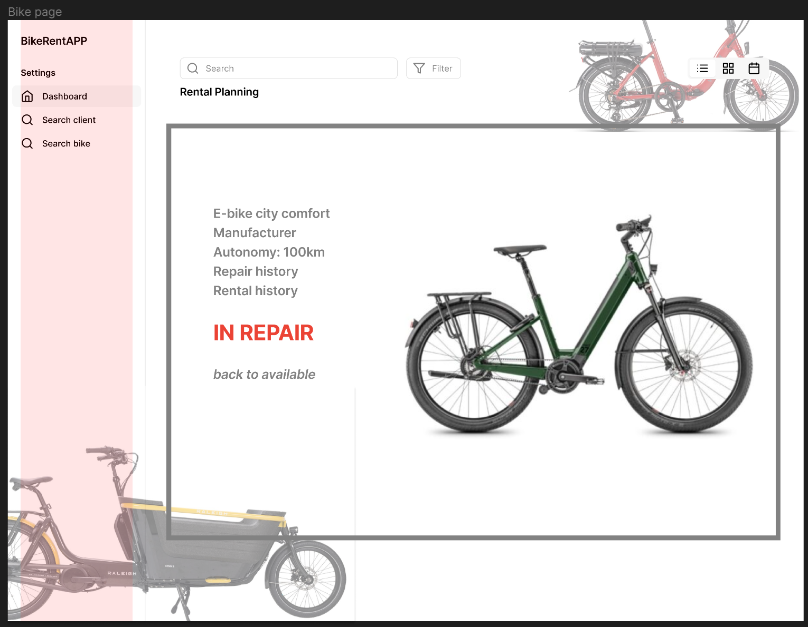

# Analyse fonctionnelle # 

## Description générale BikeRentApp ## 

Les fonctions principales de l’application de gestion de locations de vélos sont : 

- Gérer les réservations   

- Gérer les payements 

- Montrer en temps réel la disponibilité 

- Montrer en temps réel l’état de chaque vélo 

- Notifier tous les acteurs à chaque étape 

Sur le diagramme UML ci-dessous, il est possible de visualiser le processus fonctionnel principal que l’application prendra en charge : 


````mermaid
 flowchart TD
    A(booking)
    -->B(payement)
    -->C(bike ready for pick-up)
    -->D(rental)
    -->E(drop-off & check)
E-->C
    E-->G(extra payements)
    E-->F(repair)
    F-->C

````
## Utilisateurs ## 

Les utilisateurs de l’applications sont : 

- ### L’utilisateur client : ### 
  Qui utilise l’application pour faire la réservation et le payement de la location d’un ou plusieurs vélos.  

- ### L’utilisateur collaborateur du magasin : ###
  Qui utilise le calendrier de locations pour organiser son travail et préparer les vélos à louer.  

- ### L’utilisateur administrateur : ###
  Qui gère les flottes de vélos et les magasins où les vélos se trouvent.

## Ecrans ## 

- ### Liste d'ecrans du client ### 

  - Create account 
  - Sign-in 
  - Dashboard 
  - Choose dates 
  - Choose location 
  - Choose bike 
  - Confirm 
  - Cancel a booking 
  - Notify a problem 




- ### Liste d'ecrans du collaborateur du magasin ### 

  - Dashboard / planning view 
  - Page du vélo 
  - Page de la reservation
  - Page du profil client

  


[>> backlog](03-backlog.md) 
