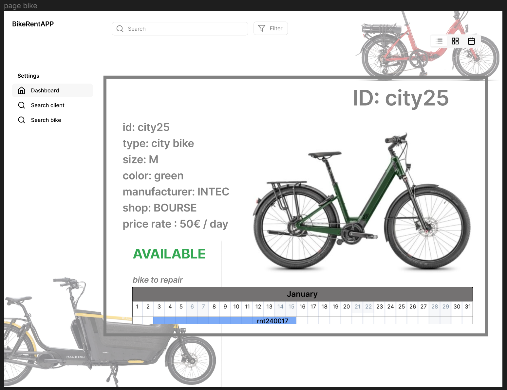

[<< introduction](01-introduction.md) 
# Analyse fonctionnelle # 

## Description générale BikeRentApp ## 

Les fonctions principales de l’application de gestion de locations de vélos sont : 

- Gérer les réservations   

- Gérer les payements 

- Montrer en temps réel la disponibilité 

- Montrer en temps réel l’état de chaque vélo 

- Notifier tous les acteurs à chaque étape 

Sur le diagramme ci-dessous, il est possible de visualiser le processus fonctionnel principal que l’application prendra en charge : 


````mermaid
 flowchart TD
    A(booking)
    -->B(payement)
    -->C(bike ready for pick-up)
    -->D(rental)
    -->E(drop-off & check)
E-->C
    E-->G(extra payements)
    E-->F(repair)
    F-->C

````
## Utilisateurs ## 

Les utilisateurs de l’applications sont : 

- ### L’utilisateur client : ### 
  Qui utilise l’application pour faire la réservation et le payement de la location d’un ou plusieurs vélos.  

- ### L’utilisateur collaborateur du magasin : ###
  Qui utilise le calendrier de locations pour organiser son travail et préparer les vélos à louer.  

- ### L’utilisateur manageur : ###
  Qui gère les flottes de vélos et les magasins où les vélos se trouvent.

## Liste d'écrans du client ## 

- Les écrans client sont conçues pour un ‘smartphone’ mais elles pourraient facilement être adaptées pour un écran d’ordinateur. Les images ci-dessous montrent les écrans principales étape par étape:  


## Liste d'écrans du collaborateur du magasin ##
<a id="link-back-1"></a>
- Dashboard : Contient un tableau calendrier qui montre les locations actives du magasin plus des liens vers les articles de location disponible dans ce magasin. Sur la gauche on trouve un menu de recherche. En bas à droite, la page montre le total de location et vélos en réparation de ce magasin. 

- Page vélo : Contient les informations de base du vélo qui correspondent aux colonnes de la table ‘bicycle’ de la base de données. La page montre aussi le calendrier de location de l’article.  Le menu sur la gauche reste inchangé. 


<a id="link-back-2"></a>
Page réservation : Contient les informations d’une réservation, qui correspondent aux colonnes de la table ‘rental’ de la base de données. Le menu sur la gauche reste inchangé. 

Page profil client : Contient les informations d’un client, qui correspondent aux colonnes de la table ‘client’ de la base de données. Le menu sur la gauche reste inchangé. 


## Liste d’écrans du manageur ##

- Dashboard : Contient des liens vers les différents ‘dashboards’ de différents magasins, ainsi qu’une vue des locations actives, vélos en réparation et disponible dans chaque magasin. La page contient aussi des liens vers les articles de location qui peuvent être triés par id, type, magasin, etc. Sur la gauche on trouve un menu qui permet d'effectuer des recherches et d'ajouter un article ou un magasin. En bas à droite, la page montre le total de location et vélos en réparation.  

- Page magasin : Contient un tableau calendrier qui montre les locations actives d’un magasin plus des liens vers les articles de location disponible dans ce magasin. Le menu sur la gauche reste inchangé. En bas à droite, la page montre le total de location et vélos en réparation de ce magasin. 


<a id="link-back-3"></a>
- Pages vélo : Contient les informations de base du vélo qui correspondent aux colonnes de la table ‘bicycle’ de la base de données. La page montre aussi le calendrier de location de l’article. Sur cette page, le manageur a la possibilité d’éditer les informations de l’article ainsi que, en suivant le lien ‘ADD RENTAL ITEM’, d’ajouter un vélo à la flotte.    


<a id="link-back-4"></a>
- Page réservation : Contient les informations d’une réservation, qui correspondent aux colonnes de la table ‘rental’ de la base de données. Le menu sur la gauche reste inchangé. 

- Page profil client : Contient les informations d’un client, qui correspondent aux colonnes de la table ‘client’ de la base de données. Le menu sur la gauche reste inchangé. 


[<< introduction](01-introduction.md) [   backlog >>](03-backlog.md) 
