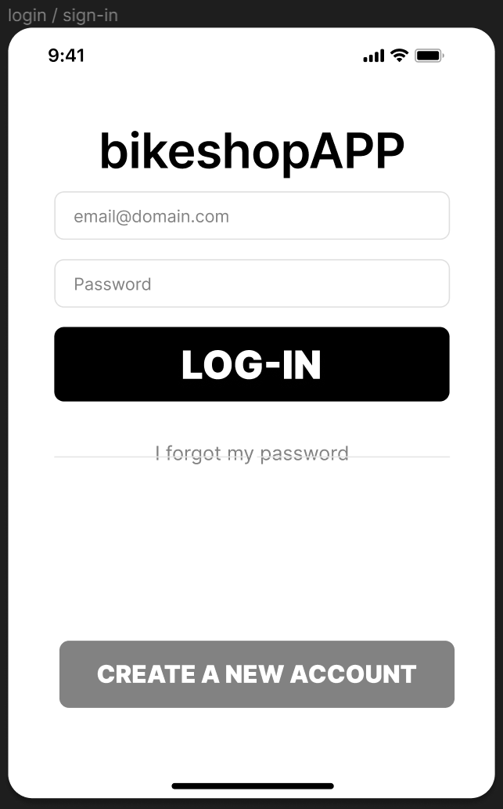

# Ecran de log-in #

L'écran de LOG-IN permet de s'identifier avec son email et mdp. Sur cet écran on trouve aussi un bouton “I forgot my password” qui renvoie l’utilisateur vers une page de récupération du mdp. Et pour finir tout en bas, on trouve le bouton “CREATE A NEW ACCOUNT” qui renvoie l’utilisateur vers le formulaire de création de nouveau compte.  
