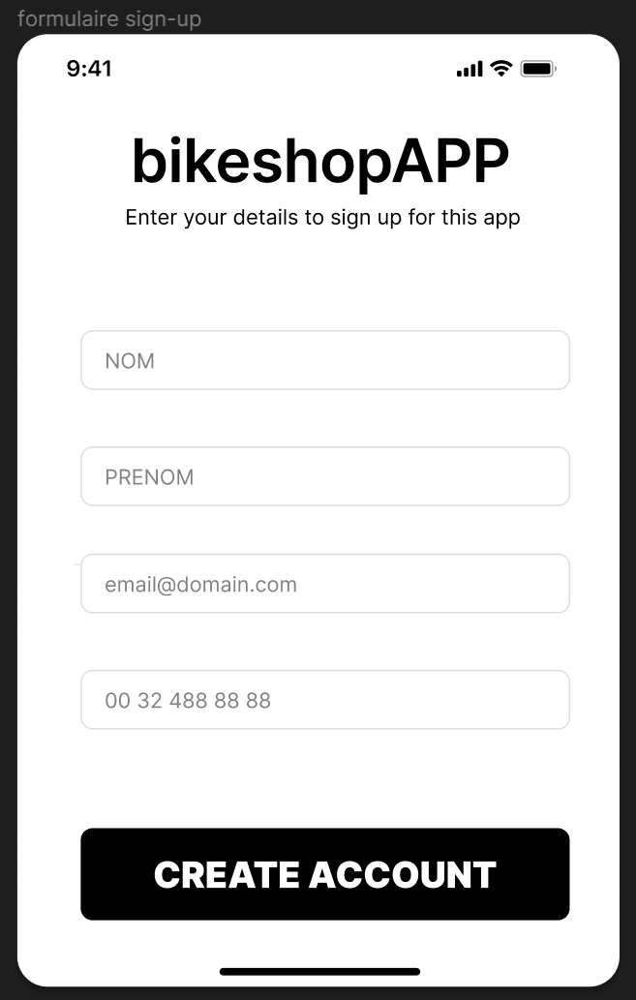

# Ecran de sign-up-form #

L'écran SIGN-UP FORM est un formulaire à remplir avec les coordonnées du client : 

- Nom 

- Prénom 

- email 

- N° de téléphone 

Tout en bas de cet écran, il y a un bouton de confirmation qui enregistre le formulaire et renvoie l’utilisateur vers la page d’accueil.  