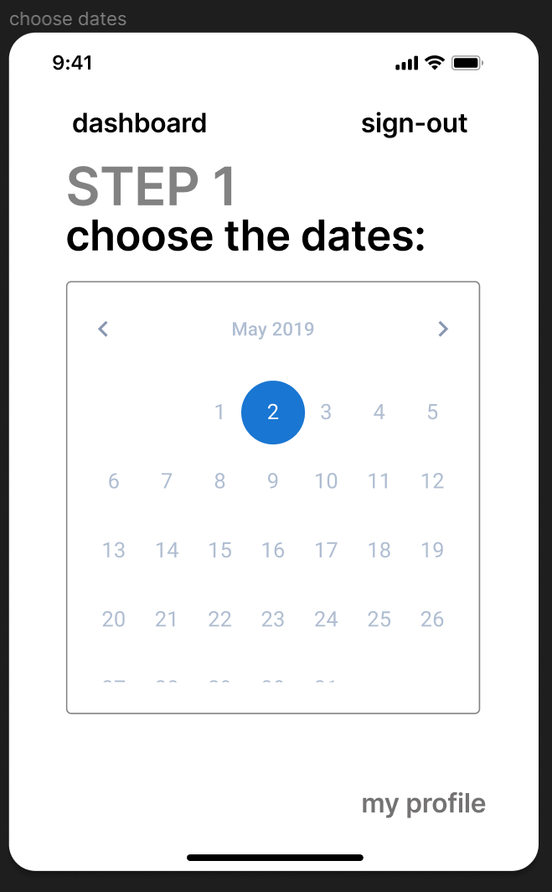
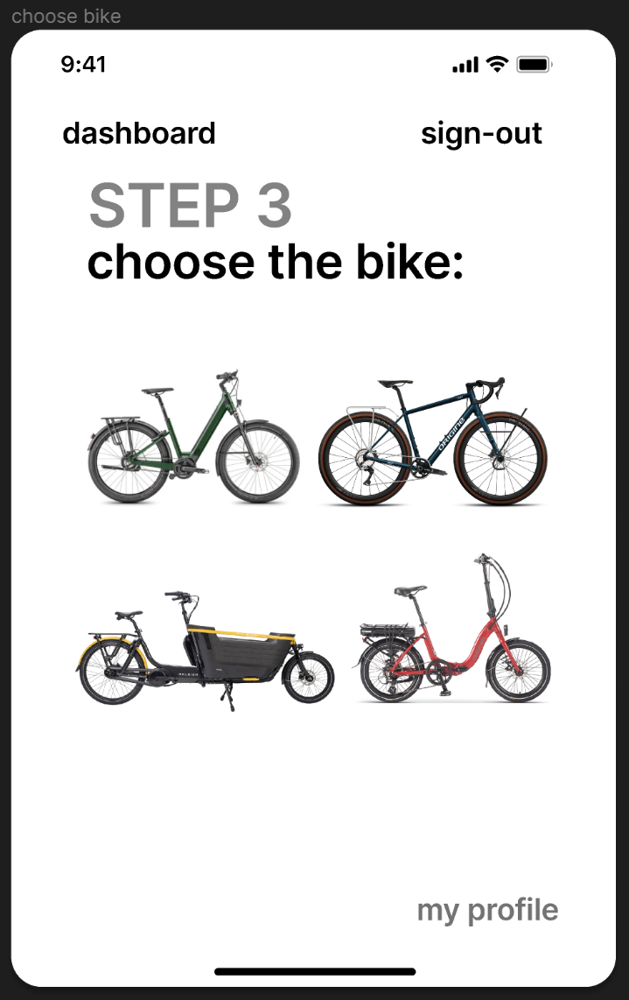
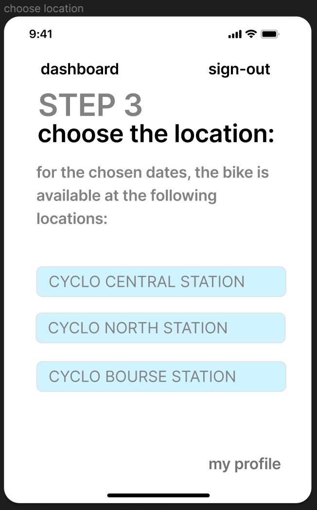
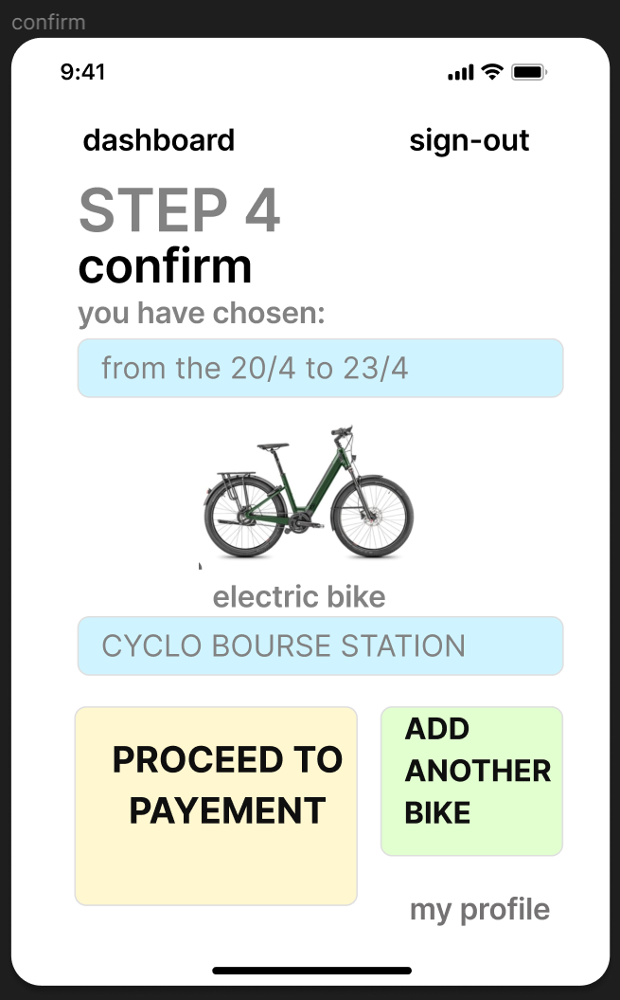

# Scenarios réservation de locations – utilisateur client # 

### Les scénarios de réservation de locations inclus les ‘User Stories’ suivantes : ###

- Client choisi une période de location (dates) 

- Client choisi un vélo 

- Client choisi un magasin de ‘pickup’ et ‘drop-off’ 

- Client confirme sélection 

### Préconditions ### 

- Le client a déjà un compte 

- Le client est authentifié 

### Scénario 1 – happy flow ###

- Depuis le ‘dashboard’ le client commence le processus en sélectionnant ‘ new booking’. 

- La première sélection à faire est la date, la sélection de dates se fait sur le calendrier.

- Ensuite, l’utilisateur choisi un vélo parmi les options que sont disponibles dans les dates choisis précédemment.

- L’utilisateur est demandé si un ’autre vélo doit être ajouté au panier.  

- Après, l’utilisateur sélectionne le magasin de ‘pick up’ parmi les options disponibles pour les dates et le type de vélo choisi.

- Puis, l’utilisateur sélectionne le magasin de ‘drop off’.
 

- Pour finir, l’utilisateur est amené sur une page résumée (panier), à partir d’où il est possible de revenir en arrière pour modifier, ou bien confirmer et passer au processus de payement.   

### Postconditions ### 

- Le client est mené au processus de payement 

- Si le processus de payement est complété correctement, des notifications sont envoyées tant vers le client que vers le magasin 

### Règles métier ### 

- La date de début de la location doit être plus petite que la date de fin 

- Le nombre de vélos choisis ne doit pas dépasser le nombre de vélos disponibles pour location dans les magasins pour les dates sélectionnées.
