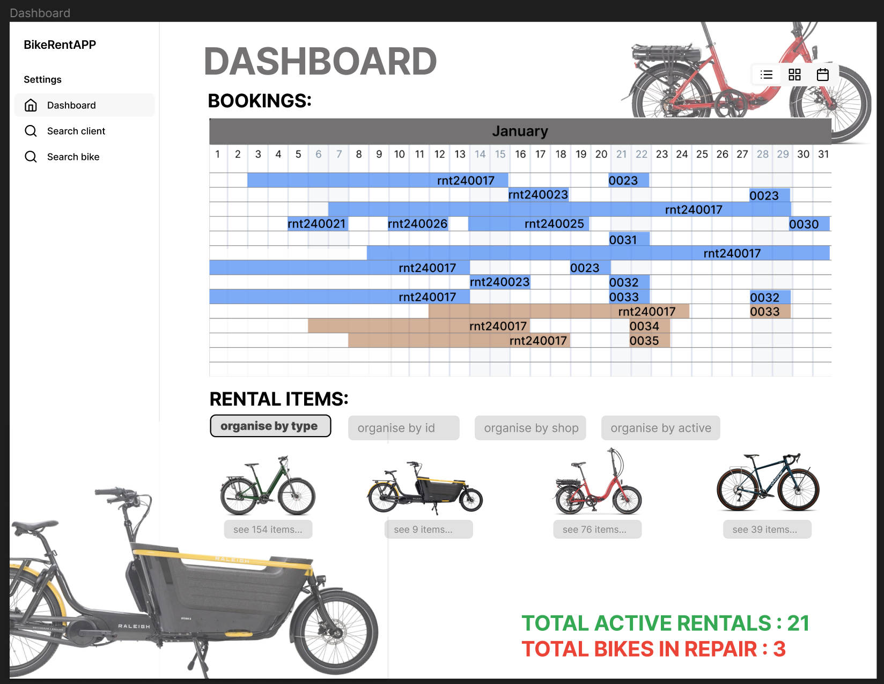
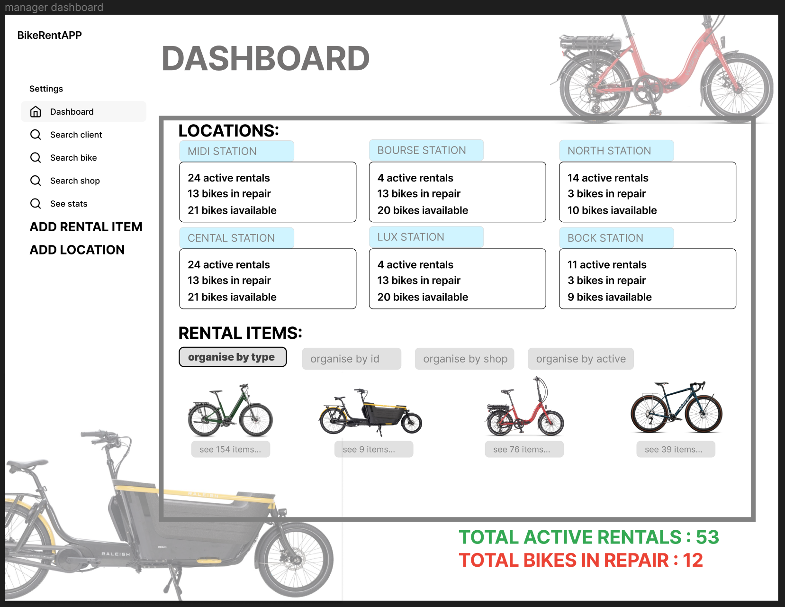

[<< backlog](03-backlog.md) 

# Liste de Scénarios # 
<h2 id="link01"> 1.- Réservation de locations – utilisateur client<h2/> 
 
### Préconditions : ### 

 - Le client a déjà un compte 
 - Le client est authentifié 
````mermaid
 flowchart TB
    A(dashboard client)
    -->B(choose date)
    -->C(choose location)
    -->D(choose bike)
    D-->F(confirm)
-->G(proceed to payement)
F--|re-start|-->B
F--|add|-->D
````
### Séquence d’écrans : ###


 - Dashboard : Client commence le processus en sélectionnant ‘add booking’ 
 - Step 1 : Client sélectionne les dates sur le calendrier 
 - Step 2 : Client sélectionne le magasin 
 - Step 3 : Client choisi un vélo  
 - Step 4 : Pour finir, l’utilisateur est amené sur une page résumée (panier), à partir d’où il est possible d'annuler (recommencer), ajouter un vélo ou bien confirmer et passer au processus de payement.
   


### Postconditions : ### 

 - Le client est mené au processus de payement 
 - Si le processus de payement est complété correctement, des notifications sont envoyées tant vers le client que vers le magasin 

### Règles métier : ### 

 - La date de début de la location doit être plus petite que la date de fin 
 - Le nombre de vélos choisis ne doit pas dépasser le nombre de vélos disponibles pour location dans les magasins pour les dates sélectionnées.

[<< backlog](03-backlog.md) 

<h2 id="link02"> 2.- Changement de statut ‘available’ <--> ‘in-repair’ – utilisateur collaborateur du magasin<h2/>

### Préconditions : ###  

- Le magasin est authentifié
- Le vélo a été ajouté au pool de vélos de location
````mermaid
 flowchart TB
    A(dashboard magasin)
    -->B(sélectionne vélo)
    -->C(change statut à 'in-repair')
    C-->A
    B-->D(change statut à 'available')
    D-->A

````
### Séquence d’écrans : ###

- Dashboard : Collaborateur sélectionne le vélo sur le dashboard 
- Page vélo : Collaborateur change le statut à ‘in-repair’ sur la page du vélo 
- Page vélo : Collaborateur change le statut à ‘available’ sur la page du vélo
  


### Postconditions : ### 

- Le vélo est remis en statut ‘disponible'

### Règles métier : ### 

- Le collaborateur doit pouvoir changer le statut d’un vélo à n’importe quel moment 
- Au moment où le vélo est mis en statut ‘in-repair’ le système doit enlever ce vélo du pool de vélos disponibles
- Au moment où le vélo est remis en statut ‘disponible’ le système doit ajouter ce vélo dans le pool de vélos disponibles
  
[<< backlog](03-backlog.md) 

<h2 id="link03"> 3.- Manageur modifie la flotte de vélos<h2/>

### Préconditions : ###  

- Le manageur est authentifié 
- Au moins un magasin a été configuré
   
````mermaid
 flowchart TB
    A(dashboard manageur)
    A-->B(sélectionne vélo)
    A-->C(ajoute vélo)
    B-->E(modifie)
    C-->A
    E-->A

````

### Séquence d’écrans : ###

- Dashboard : Manageur sélectionne le vélo à modifier, ou bien ‘ADD RENTAL ITEM’ pour ajouter un nouveau vélo dans la flotte. 
- Page vélo : L’utilisateur manageur a la possibilité de faire des modifications sur un vélo existante en cliquant sur ‘Modify item’. 
- Page création vélo : L’utilisateur manageur a la possibilité d'ajouter un ou plusieurs vélos du même type dans un ou plusieurs magasins.  



### Postconditions : ### 

- Le nouveau vélo, ou bien les modifications du vélo existant, sont enregistrés dans la base de données. 
- Le magasin concerné reçoie une notification.  

### Règles métier : ### 

- Chaque vélo doit avoir un ID métier unique (voir schéma de la base de données). Lors de la création d’un nouveau vélo, on doit avoir la possibilité de créer les IDs manuellement ou bien automatiquement.   

[<< backlog](03-backlog.md)        [database >>](05-database.md) 
